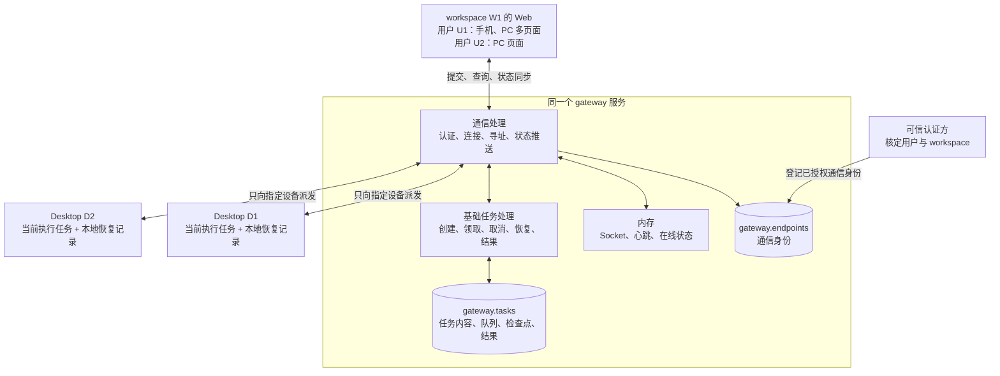
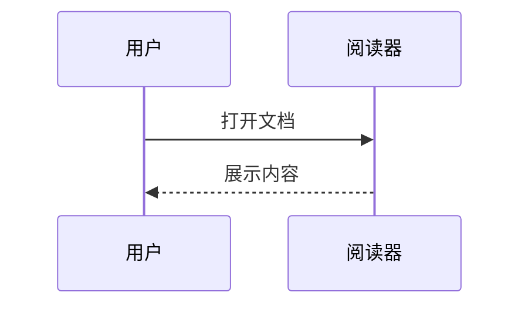

# Markdown 兼容性样本

这里检查中文、**粗体**、*斜体*、~~删除线~~、`行内代码` 和 https://example.com 自动链接。

[跳到公式](#数学公式) · [打开关联文档](welcome.md#公式也很自然) · [外部链接](https://example.com)

## 表格与任务

| 功能 | 结果 |
| :--- | ---: |
| 表格 | 支持 |
| 中文 | 正常 |

- [x] 已完成任务
- [ ] 待办事项

## 原始架构图



## 时序图



## 数学公式

行内公式 $E = mc^2$，GitHub 风格 $`\sqrt{3x-1}`$。价格 $10 和 $20 应保留原文。

$$
\begin{pmatrix} 1 & 2 \\ 3 & 4 \end{pmatrix}
\qquad \sum_{i=1}^{n} i = \frac{n(n+1)}{2}
$$

```math
\int_0^1 x^2\,dx = \frac{1}{3}
```

## 提示与折叠

> [!NOTE]
> 这是 GitHub 风格提示。

> [!WARNING]
> 这是注意事项。

::: tip 小提示
这是 VitePress 风格的提示容器，支持 **Markdown**。
:::

::: details 展开详情
折叠区中的内容。
:::

<details><summary>HTML 折叠区</summary>

允许安全的 HTML 排版。<br/>这一行经过换行。

</details>

## 图片与代码


```typescript
const greeting: string = '你好，Markdown';
console.log(greeting);
```

这里有一条脚注[^note]。

[^note]: 脚注内容可以包含 **格式**。

## 错误隔离

下面是故意写错的图，应显示错误和原文，后面的正文仍可阅读。

```mermaid
flowchart TB
    A[broken
```

**图表错误后，文档仍然可读。**
