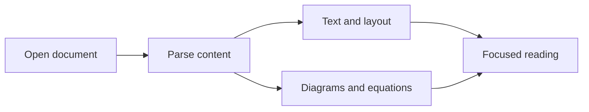

# Give your words room to breathe.

Welcome to **Markview**, a quiet place to read and edit Markdown, diagrams, and equations.

Click **Open document** or drop a `.md` file into the window. Choose **Edit** to write with a live preview. Drag the divider to adjust the panes, or choose **Hide preview** to focus on writing.

## More than plain text

Open technical notes, project documentation, and study guides in one place.

| Content            | Supported features                                     |
| :----------------- | :----------------------------------------------------- |
| Everyday documents | Headings, lists, quotes, links, and images             |
| Developer notes    | Syntax highlighting, task lists, and footnotes         |
| Diagrams           | Mermaid flowcharts, sequence diagrams, and ER diagrams |
| Math notes         | Inline and display equations                           |

## Turn ideas into diagrams

Use **Expand** to zoom into a larger diagram.

## Equations feel at home

Write an inline equation such as $E = mc^2$, or give it its own space:

$$
\int_a^b f(x)\,dx = F(b) - F(a)
$$

## Keep your reading rhythm

- [x] Jump between sections using the document outline
- [x] Search, adjust text size, and switch between light and dark themes
- [x] Refresh saved files while keeping your reading position
- [x] Edit Markdown with a live preview and adjustable pane widths
- [x] Hide the preview when you want more writing space
- [x] Save and save as, with a reminder before discarding edits
- [x] Work locally without an account or uploading your documents

> [!TIP]
> Save with `⌘S` / `Ctrl+S`. If another editor changes the file, Markview keeps your draft and warns you before overwriting anything.

::: details Which Markdown extensions are supported?
Common GitHub Markdown, Mermaid, equations, footnotes, YAML metadata, GitHub alerts, and VitePress-style containers.

Custom site components, MDX scripts, and Obsidian note embeds are not executed or resolved.
:::
