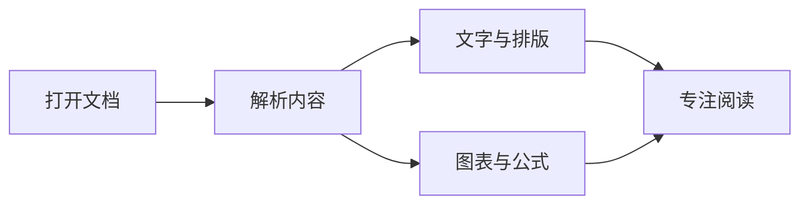

# 让文字，清晰可见。

欢迎使用 **墨阅 Markview**。一个安静、专注的阅读空间，让 Markdown 文档里的文字、图表与公式自然呈现。

点击左上角 **打开文档**，或把 `.md` 文件拖入窗口，即可开始阅读。点击 **编辑**，就能边写边看。拖动中间分隔线可以调整宽度，也可以点击 **隐藏预览** 专注写作。

## 不止于文字

技术方案、项目说明、学习笔记，都可以在这里打开。

| 内容     | 渲染支持                      |
| :------- | :---------------------------- |
| 日常文档 | 标题、列表、表格、链接与图片  |
| 开发文档 | 代码高亮、任务列表、脚注      |
| 技术图表 | Mermaid 流程图、时序图、ER 图 |
| 数学笔记 | 行内公式与独立公式            |

## 把思路画出来

图表较大时，点击右上角的 **放大**，可以在独立预览层中缩放阅读。

## 公式，也很自然

无论是行内的 $E = mc^2$，还是单独成行的推导：

$$
\int_a^b f(x)\,dx = F(b) - F(a)
$$

## 保留你的阅读节奏

- [x] 通过左侧目录，快速跳转章节
- [x] 查找关键词、调整字号与深浅主题
- [x] 文档保存后自动刷新，保留阅读位置
- [x] 左侧编辑源码，右侧实时预览图表与公式
- [x] 保存与另存为，离开前提醒未保存的修改
- [x] 本地渲染，无需账号，无需上传文档

> [!TIP]
> 使用 `⌘S` / `Ctrl+S` 保存。文件被其他编辑器修改时，墨阅会保留草稿并提示冲突。

::: details 支持哪些扩展语法？
常见 GitHub Markdown、Mermaid、数学公式、脚注、YAML 文档信息、GitHub 提示块与 VitePress 风格提示容器。

平台自定义组件、MDX 脚本和 Obsidian 笔记嵌入暂不执行或解析。
:::
